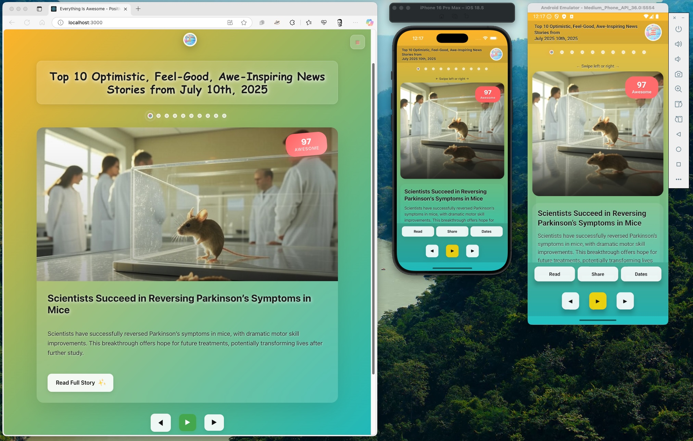

# Everything Is Awesome 🌟

A beautiful cross-platform application displaying optimistic, feel-good news stories that restore hope in humanity. This project fetches real news articles, analyzes them with AI for sentiment and positivity, then presents the most uplifting stories with an engaging user interface.

**🚀 Live Demo**: [https://everythingisawesome.news/](https://everythingisawesome.news/)

## 📱 Cross-Platform Architecture

This monorepo contains four main components:

### 🌐 Web Application (`/client`)
- **React 19** web application
- Responsive design with glassmorphism UI
- Deployed to Azure Web Apps

### 📱 Mobile Application (`/mobile`)
- **React Native** with Expo
- Native iOS and Android support  
- **Swipe Gestures** - Navigate between stories with intuitive swipe controls
- **Haptic Feedback** - Enhanced mobile experience with touch feedback
- **Native Sharing** - Built-in share functionality for stories
- **Auto-rotation** - Stories automatically transition every 30 seconds
- **Touch Navigation** - Tap on story content to view detailed view
- **Responsive Design** - Optimized for mobile screens and interactions
- **Cross-platform** - Single codebase for iOS, Android, and web
- Shared business logic with web

### 🚀 Backend API (`/server`)
- **Node.js & Express** REST API
- AI-powered news analysis
- Shared by both web and mobile clients

### 🔄 Shared Libraries (`/packages`)
- **shared-api** - Platform-agnostic API layer
- **shared-components** - Reusable UI components
- **shared-constants** - Application constants
- **shared-docs** - Documentation utilities
- **shared-hooks** - Custom React hooks
- **shared-types** - Type definitions
- **shared-utils** - Common utility functions
- **shared** - Core shared functionality

**Here's how the application looks across platforms:**



## 💻 Tech Stack

### Frontend
- **React 19** - Modern UI framework with hooks
- **React Router DOM 7** - Client-side routing for SPA navigation
- **Axios** - HTTP client for API communication
- **CSS3** - Glassmorphism design with animations
- **Responsive Design** - Mobile-first approach

### Backend
- **Node.js 22** - JavaScript runtime
- **Express.js** - Web application framework
- **fs-extra** - Enhanced file system operations
- **node-cron** - Scheduled task management
- **cors** - Cross-origin resource sharing
- **dotenv** - Environment variable management

### AI & APIs
- **Grok-3-latest** - X.AI's most advanced model for enhanced sentiment analysis with anti-commercial filtering
- **Grok-2-image** - AI-powered custom image generation based on story themes
- **NewsAPI** - Real-time news data from 100+ diverse sources
- **Advanced Prompting** - Specialized AI prompt engineering to distinguish genuine content from promotional material
- **Generic Duplicate Detection** - Fuzzy string matching algorithms with scientifically optimized thresholds

### Cloud & DevOps
- **Azure Web App** - Production hosting (Windows App Service Plan)
- **Azure Blob Storage** - Scalable cloud file storage with automatic fallback
- **File System Abstraction** - Unified storage API supporting local and cloud storage
- **GitHub Actions** - CI/CD pipeline automation
- **IISNode** - Node.js integration for Windows App Service
- **Azure CLI** - Infrastructure management and deployment

### Data & Storage
- **Flexible Storage Architecture** - Supports both local file system and Azure Blob Storage
- **Automatic Storage Detection** - Intelligently selects storage backend based on configuration
- **File System Abstraction** - Unified API for seamless storage migration
- **JSON File System** - Lightweight data persistence
- **Static File Serving** - Express.js static middleware with cloud storage support
- **Image Storage** - Organized file system structure with Azure integration
- **Data Persistence** - Deployment-safe data retention across storage backends

### Development Tools
- **concurrently** - Run multiple npm scripts simultaneously
- **nodemon** - Development server auto-restart
- **Git** - Version control with GitHub integration
- **VS Code** - Recommended development environment

## ✨ Features

### 🌐 Web Application
- **Real News Sources**: Fetches authentic articles from 100+ news providers via NewsAPI
- **Advanced AI Curation**: Uses Grok-3-latest with specialized prompts to distinguish genuine inspiring content from commercial promotions
- **AI-Generated Images**: Custom images generated using Grok-2-image based on story themes with fallback category images
- **Proprietary Awesome Index**: Advanced 6-step algorithm (50-100 scale) with anti-commercial filtering and duplicate detection
- **Generic Duplicate Detection**: Advanced fuzzy string matching using 12 similarity algorithms with 100% accuracy on test data
- **Content Quality Assurance**: Multi-stage filtering eliminates promotional content, maintains 40+ positivity threshold
- **Modern UI**: Glassmorphism design with smooth animations and responsive layout
- **Smart Navigation**: Browse between different days with intuitive controls
- **Automated Collection**: Daily processing with robust error handling and source diversity
- **Azure Cloud Deployment**: Production-ready deployment on Azure Web App with CI/CD
- **Flexible Storage Architecture**: Seamlessly supports local file system and Azure Blob Storage
- **Intelligent Storage Detection**: Automatically configures optimal storage backend based on environment
- **Persistent Data Storage**: Generated images and news data persist between deployments
- **Source Flexibility**: Optional filtering by reputable sources (currently disabled for maximum diversity)

### 📱 Mobile Application
- **Cross-Platform**: Single React Native codebase runs on iOS, Android, and web
- **Swipe Navigation**: Intuitive left/right swipe gestures to navigate between stories
- **Haptic Feedback**: Enhanced mobile experience with tactile responses
- **Native Sharing**: Built-in platform sharing for stories via SMS, email, social media
- **Auto-Rotation**: Stories automatically transition every 30 seconds (pausable)
- **Touch Interactions**: Tap story content or use dedicated "View Details" button
- **Story Details Screen**: Full-screen story view with comprehensive information
- **Theme-Based Gradients**: Dynamic color schemes based on story categories
- **Mobile-Optimized UI**: Designed specifically for touch interfaces
- **Offline-Ready**: Cached data for improved performance
- **Real-time API**: Seamless integration with the same backend as web

## 🚀 Quick Start

### Prerequisites
- Node.js 18+ and npm 8+
- For mobile development: Expo CLI
- Git for version control

### Installation & Setup

```bash
# Clone the repository
git clone <your-repo-url>
cd everythingisawesome

# Install all dependencies (web, mobile, and server)
npm run install-all

# Set up environment variables
# Copy .env.example to .env and add your API keys:
# - GROK_API_KEY=your_grok_api_key
# - NEWS_API_KEY=your_news_api_key
# - GROK_MODEL=grok-3-latest (optional - has default)
# - GROK_IMAGE_MODEL=grok-2-image (optional - has default)
# - GROK_SENTIMENT_MAX_TOKENS=10 (optional - has default, use 200 for grok-4)
# - GROK_SUMMARY_MAX_TOKENS=100 (optional - has default, use 250 for grok-4)
# - GROK_IMAGE_PROMPT_MAX_TOKENS=150 (optional - has default, use 300 for grok-4)
#
# For Azure Blob Storage (optional - local file system used by default):
# - AZURE_STORAGE_ENABLED=true (set to enable Azure Blob Storage)
# - AZURE_STORAGE_ACCOUNT_NAME=your_storage_account_name
# - AZURE_STORAGE_ACCOUNT_KEY=your_storage_account_key
# - AZURE_STORAGE_CONTAINER_NAME=your_container_name
```

### Development Commands

```bash
# Start web + server (recommended for web development)
npm run dev

# Start mobile + server (for mobile development)
npm run dev:mobile

# Start everything (web + mobile + server)
npm run dev:all

# Individual components
npm run server     # Backend API only
npm run client     # Web app only
npm run mobile     # Mobile app only
```

### Building for Production

```bash
# Build web application
npm run build

# Build mobile application
npm run build:mobile
```

**📖 For comprehensive development setup, testing, deployment, and troubleshooting, see: [DEVELOPMENT_AND_DEPLOYMENT.md](./docs/DEVELOPMENT_AND_DEPLOYMENT.md)**

## 📁 Project Structure

```
everythingisawesome/
├── client/                 # React Web Application
│   ├── src/
│   │   ├── components/    # React components
│   │   ├── services/      # API services
│   │   └── App.js
│   └── package.json
│
├── mobile/                 # React Native Mobile App
│   ├── src/
│   │   ├── screens/       # Mobile screens
│   │   ├── components/    # Mobile components
│   │   ├── services/      # Mobile API services
│   │   └── styles/        # Mobile stylesheets
│   ├── App.js
│   └── package.json
│
├── server/                 # Backend API & Jobs
│   ├── index.js           # Express server
│   ├── jobs/              # Scheduled tasks
│   ├── routes/            # API routes
│   ├── scripts/           # Utility scripts
│   ├── utils/             # Server utilities
│   └── filesystem/        # File system abstraction layer
│       ├── FileSystemFactory.js      # Storage system selector
│       ├── LocalFileSystem.js        # Local file operations
│       └── AzureBlobFileSystem.js    # Azure Blob Storage operations
│
├── shared/                 # Shared Libraries
│   ├── api.js             # Platform-agnostic API layer
│   ├── utils.js           # Common utilities
│   └── types.js           # Type definitions
│
├── data/                   # News data storage
│   ├── *.json             # Daily news files
│   └── generated-images/  # AI-generated images
│
└── package.json           # Root package manager
```

## 🔄 Development Workflow

### For Web Development
```bash
npm run dev              # Starts server + web client
# Open http://localhost:3000
```

### For Mobile Development
```bash
npm run dev:mobile       # Starts server + mobile app
# Use Expo app on your phone or simulator
```

### For Full-Stack Development
```bash
npm run dev:all          # Starts everything
# Web: http://localhost:3000
# Mobile: Use Expo app
# API: http://localhost:3001
```

## 📱 Mobile Development

The mobile app is built with **Expo** and **React Native**, providing:

- **Cross-platform**: Single codebase for iOS and Android
- **Shared Logic**: Reuses business logic from web app
- **Native Feel**: Platform-specific UI components
- **Easy Testing**: Use Expo app for instant preview

### Mobile-Specific Features
- Gesture-based navigation
- Native animations
- Pull-to-refresh
- Haptic feedback
- Push notifications (coming soon)

### Testing Mobile App

1. Install Expo app on your phone
2. Run `npm run dev:mobile`
3. Scan QR code with Expo app
4. App updates automatically as you develop

### Building and Sideloading Android APK

For testing on Android devices without the Expo app, you can build a standalone APK:

#### Prerequisites
Ensure you have the following installed (no need to reinstall if already available):
- **Java Development Kit (JDK)**: OpenJDK 17 or later
  ```bash
  # Check if already installed
  java -version
  
  # If not installed, install with Homebrew:
  brew install openjdk@17
  
  # Add to your shell profile (.zshrc, .bashrc, etc.):
  export JAVA_HOME="/opt/homebrew/opt/openjdk@17/libexec/openjdk.jdk/Contents/Home"
  export PATH="$JAVA_HOME/bin:$PATH"
  ```
- **Android SDK**: Available if you have Android Studio installed
- **React Native CLI**: Install if not already available
  ```bash
  npm install -g @react-native-community/cli
  ```

#### Build Process
1. **Navigate to mobile directory**:
   ```bash
   cd mobile
   ```

2. **Ensure dependencies are installed**:
   ```bash
   npm install
   ```

3. **Build Release APK** (recommended - standalone with embedded JavaScript bundle):
   ```bash
   # Verify Watchman is working (should show version number)
   watchman version
   
   # Build production APK with embedded bundle
   ./android/gradlew -p android assembleRelease
   
   # APK location: android/app/build/outputs/apk/release/app-release.apk (~70MB)
   ```

4. **Alternative: Build Debug APK** (requires Metro bundler running):
   ```bash
   # Only use if you need development build
   npx expo run:android --variant debug
   
   # APK location: android/app/build/outputs/apk/debug/app-debug.apk (~165MB)
   ```

#### Sideloading to Android Device

1. **Enable Developer Options** on your Android device:
   - Go to Settings → About Phone
   - Tap "Build Number" 7 times until developer mode is enabled
   - Go back to Settings → Developer Options (or System → Developer Options)
   - Enable "USB Debugging"

2. **Connect device and verify**:
   ```bash
   adb devices
   # Should show: emulator-5554    device (or your device ID)
   ```

3. **Install the APK**:
   ```bash
   # Install release APK (recommended - works without Metro)
   adb install -r mobile/android/app/build/outputs/apk/release/app-release.apk
   
   # Or install debug APK (requires Metro bundler running)
   adb install -r mobile/android/app/build/outputs/apk/debug/app-debug.apk
   ```

4. **Launch the application**:
   ```bash
   adb shell am start -n com.jcallico.everythingisawesome/.MainActivity
   ```

#### APK Comparison
| Build Type | Size | Metro Required | JavaScript Bundle | Use Case |
|------------|------|----------------|-------------------|----------|
| **Release** | ~70MB | No | Embedded | Production/Distribution |
| **Debug** | ~165MB | Yes | External | Development/Testing |

#### Quick Troubleshooting
- **Build fails**: Clean with `cd mobile/android && ./gradlew clean` then rebuild
- **Watchman errors**: Run `watchman shutdown-server` and restart the build
- **"Too many open files"**: Run `ulimit -n 4096` before building
- **Permission issues**: Fix with `sudo chown -R $(whoami) ~/Library/LaunchAgents/`
- **Device not detected**: Check USB debugging is enabled and accept computer authorization on device

### Building Play Store Release (AAB)

For Google Play Store submission, you need to build a properly signed Android App Bundle (AAB):

#### Production Keystore Setup

1. **Generate production keystore** (one-time setup):
   ```bash
   cd mobile/android/app
   keytool -genkey -v -keystore everything-is-awesome-release-key.keystore \
     -alias everything-is-awesome -keyalg RSA -keysize 2048 -validity 10000 \
     -storepass YOUR_STORE_PASSWORD -keypass YOUR_KEY_PASSWORD \
     -dname "CN=Your Name, OU=Your Unit, O=Your Org, L=Your City, ST=Your State, C=Your Country"
   ```

2. **Create keystore properties file**:
   ```bash
   # Create: mobile/android/keystore.properties
   echo "storePassword=YOUR_STORE_PASSWORD
   keyPassword=YOUR_KEY_PASSWORD
   keyAlias=everything-is-awesome
   storeFile=everything-is-awesome-release-key.keystore" > mobile/android/keystore.properties
   ```

3. **Secure your credentials**:
   - Keep `keystore.properties` and `*.keystore` files secure and backed up
   - These files are automatically added to `.gitignore`
   - ⚠️ **Critical**: You need the exact same keystore for all future app updates!

#### Build AAB for Play Store

```bash
cd mobile

# Build the Android App Bundle (AAB) for Play Store submission
./android/gradlew -p android bundleRelease

# Output location: android/app/build/outputs/bundle/release/app-release.aab (~46MB)
```

#### Release Artifact Details

- **File**: `mobile/android/app/build/outputs/bundle/release/app-release.aab`
- **Size**: ~46MB (optimized for Play Store distribution)
- **Format**: Android App Bundle (AAB) - required for Google Play Store
- **Signing**: Production-signed with your release keystore
- **Optimization**: Google Play will generate optimized APKs for different devices

#### Play Store Submission Checklist

- ✅ **AAB file**: Use `app-release.aab` for upload
- ✅ **Signing certificate**: SHA-256 fingerprint available via:
  ```bash
  keytool -list -v -keystore mobile/android/app/everything-is-awesome-release-key.keystore \
    -alias everything-is-awesome -storepass YOUR_PASSWORD
  ```
  - Current development keystore SHA-256: `12:FA:F7:3C:B7:05:8F:B8:0C:95:42:86:67:42:2A:05:64:9B:E2:E8:AD:5A:2A:A7:62:F0:7C:20:4A:9B:30:AD`
- ✅ **Version info**: Update `versionCode` and `versionName` in `android/app/build.gradle`
- ✅ **App metadata**: Prepare app description, screenshots, and store listing
- ✅ **Testing**: Verify the app works correctly before submission

#### Security Notes

- **Keystore backup**: Store your keystore and properties files securely
- **Password strength**: Use strong passwords for production keystores
- **Version control**: Keystore files are excluded from Git for security
- **Certificate validity**: Generated certificates are valid for 27+ years

#### Quick Reference

**Common Build Commands**:
```bash
# Development APK (requires Metro)
npx expo run:android --variant debug

# Standalone APK (no Metro required)  
./android/gradlew -p android assembleRelease

# Play Store AAB (production)
./android/gradlew -p android bundleRelease
```

**File Locations**:
- Debug APK: `android/app/build/outputs/apk/debug/app-debug.apk` (~165MB)
- Release APK: `android/app/build/outputs/apk/release/app-release.apk` (~70MB)
- Release AAB: `android/app/build/outputs/bundle/release/app-release.aab` (~46MB)

**Distribution Methods**:
- **Development/Testing**: Debug APK or Expo app
- **Sideloading**: Release APK for manual installation
- **Play Store**: Release AAB for store submission

## 🎮 Usage

### Manual Commands

- **Start development servers**: `npm run dev` (runs both client and server)
- **Fetch real news**: `npm run fetch-news [YYYY-MM-DD]` (optional date parameter)
- **Create sample data**: `npm run create-sample` (for testing without API keys)
- **Generate themed fallback images**: `npm run generate-themed-fallbacks` (creates 9 themed fallback images)
- **Build for production**: `npm run build`
- **Start production server**: `npm start`
- **Install all dependencies**: `npm run install-all`

### Fetching News

**Fetch news for a specific date:**
```bash
npm run fetch-news 2025-06-01
```

**Fetch news for yesterday (default):**
```bash
npm run fetch-news
```

**Current Data Coverage:**
The project currently has news data for June 1-17, 2025 (17 days of content) with over 180 AI-generated story images.

## 📁 Project Structure

```
everythingisawesome/
├── client/                 # React Web Application (port 3000)
│   ├── src/
│   │   ├── components/     # React components
│   │   │   ├── Header.js   # Site header with navigation
│   │   │   ├── HomePage.js # Main news page (handles both latest and date-specific news)
│   │   │   └── NewsDisplay.js # News story cards
│   │   ├── services/       # API service layer
│   │   │   └── api.js      # Centralized API calls
│   │   └── App.css         # Beautiful glassmorphism styling
│   ├── build/              # Production build (auto-generated)
│   └── package.json
├── mobile/                 # React Native Mobile App
│   ├── src/
│   │   ├── screens/        # Mobile screens
│   │   ├── components/     # Mobile components
│   │   ├── services/       # Mobile API services
│   │   └── constants/      # Mobile constants
│   ├── App.js              # Main mobile app entry
│   ├── app.json            # Expo configuration
│   ├── android/            # Android platform files
│   ├── ios/                # iOS platform files
│   └── package.json
├── server/                 # Node.js Backend API (port 3001)
│   ├── routes/
│   │   └── news.js         # News API endpoints
│   ├── jobs/
│   │   ├── fetchNews.js    # AI-powered news fetcher
│   │   ├── createSampleData.js # Sample data generator
│   │   └── generateThemedFallbacks.js # Fallback image generator
│   ├── utils/
│   │   └── newsUtils.js    # File and data operations
│   └── index.js            # Express server with static file serving
├── packages/               # Shared Libraries (Monorepo)
│   ├── shared-api/         # Common API layer
│   ├── shared-components/  # Reusable UI components
│   ├── shared-constants/   # Shared constants
│   ├── shared-docs/        # Documentation utilities
│   ├── shared-hooks/       # Custom React hooks
│   ├── shared-types/       # TypeScript/JSDoc types
│   ├── shared-utils/       # Common utilities
│   └── shared/             # Core shared functionality
├── data/                   # Persistent Data Storage
│   ├── generated-images/   # AI-generated story images
│   │   ├── story-*.png     # Individual story images
│   │   └── fallback-*.png  # Themed fallback images
│   └── YYYY-MM-DD.json     # Daily news data files
├── docs/                   # Documentation
│   ├── DEVELOPMENT_AND_DEPLOYMENT.md # Comprehensive development & deployment guide
│   └── *.jpg               # Screenshots and images
├── android/                # Android build configuration
├── .github/workflows/      # GitHub Actions CI/CD
│   └── main_everythingisawesome.yml # Deployment pipeline
├── app.js                  # Azure Web App entry point
├── web.config              # IIS/Azure configuration
├── deploy.cmd              # Azure deployment script
├── package.json            # Root dependencies and scripts
├── .env.example            # Environment template
└── README.md
```

## 🔌 API Endpoints

- `GET /api/news/latest` - Get the most recent news
- `GET /api/news/date/:date` - Get news for a specific date (YYYY-MM-DD)
- `GET /api/news/dates` - Get all available dates (sorted newest first)
- `GET /api/health` - Application health check and diagnostics
- `GET /api/debug` - Detailed server information for troubleshooting
- `GET /generated-images/*` - Serve AI-generated story images

Example API response:
```json
{
  "date": "2025-06-17",
  "title": "Top 10 Optimistic, Feel-Good, Awe-Inspiring News Stories",
  "stories": [
    {
      "title": "Breakthrough in HIV Cure Research",
      "summary": "A Melbourne research team discovered a method...",
      "link": "https://example.com/article",
      "awesome_index": 95,
      "imageUrl": "/generated-images/story-1-1750240900848.png",
      "source": "bbc-news",
      "theme": "medical"
    }
  ]
}
```

## 🤖 How the Algorithm Works

The application uses a sophisticated **6-step curation process** to surface genuinely inspiring stories while filtering out commercial content and negativity bias:

### Step 1: News Article Fetching
- Uses **NewsAPI** to query up to 100 articles daily from 100+ diverse global sources
- Searches with 50+ carefully selected positive keywords: "breakthrough," "cure," "rescue," "discovery," "innovation," "helping," "volunteer," "charity," "triumph," "milestone," "achievement"
- Source filtering currently disabled for maximum content diversity
- Processing limited to 50 articles for API cost management vs. coverage balance

### Step 2: Multi-Stage Pre-Filtering
- **Keyword Filter**: Eliminates articles with zero positive keywords
- **Quality Check**: Filters out placeholder "[Removed]" content from NewsAPI
- **Sentiment Threshold**: Removes articles scoring below 40/100 in positivity
- **Commercial Content Detection**: AI-powered identification of sales/promotional content

### Step 3: Enhanced AI Analysis with Grok-3-Latest
- **Anti-Commercial Filtering**: Product sales/promotional content automatically scored 0-20
- **Main Event Focus**: Algorithm evaluates the primary news event, not just positive entities mentioned
- **Negative Event Detection**: Stories about crimes, scams, or disasters score low even if good organizations are mentioned
- **Charity Exception**: Legitimate fundraising and charity auctions maintain high scores
- **Genuine Content Prioritization**: Scientific breakthroughs, community achievements, and inspiring human stories score 80-100
- **Contextual Understanding**: Distinguishes genuine achievements from marketing content
- **Smart Summarization**: Generates concise, uplifting summaries highlighting inspiring aspects
- **Robust Error Handling**: 3-retry system with fallback scores (50) for reliability

### Step 4: Proprietary Awesome Index Calculation
**Formula**: `Awesome Index = max(50, min(100, sentiment_score + keyword_boost))`

- **Base Sentiment Score**: AI-generated positivity rating (50-100 range)
- **Keyword Density Bonus**: Up to 10 additional points for articles mentioning multiple positive themes
- **Commercial Penalty**: Significant score reduction for sales/promotional content
- **Final Range**: All scores normalized to 50-100 scale, ensuring minimum positivity threshold

### Step 5: Generic Duplicate Detection
Advanced duplicate story detection using cutting-edge fuzzy string matching:
- **12 Similarity Algorithms**: Analyzes titles, summaries, and combined text using ratio, partial ratio, token sort, and token set matching
- **No Hardcoded Keywords**: Purely generic approach that works for any news content (health, sports, politics, entertainment, etc.)
- **Optimal Threshold**: Uses scientifically determined threshold of 70 for maximum accuracy
- **Smart Selection**: Keeps the highest awesome_index story from each duplicate group
- **Proven Performance**: Achieved 100% precision and 100% recall on test data with zero false positives
- **Universal Coverage**: Works across all news categories without requiring manual keyword maintenance

### Step 6: Content Enhancement & Final Selection
- Sorts by awesome_index in descending order
- Removes duplicate stories using generic fuzzy matching algorithm
- Selects top 10 most inspiring unique stories (or all if fewer than 10 qualify)
- **Custom Image Generation**: AI-created visuals using Grok-2-image based on story themes
- **Themed Fallbacks**: Pre-generated category images when AI generation fails
- Preserves authentic source URLs for credibility

### Performance Metrics & Results
Recent algorithm performance (June 2025 data):
- **Articles Processed**: 50-100 per day from NewsAPI
- **Commercial Filtering Success**: ~95% of sales/promotional articles automatically filtered out
- **Content Quality**: Awesome indices ranging from 52-91 with improved distribution
- **Content Diversity**: Community service, scientific discoveries, education, technology breakthroughs, environmental progress
- **Source Variety**: 20+ different news outlets and platforms with quality-focused filtering

### Configuration Options
```javascript
// In fetchNews.js
const USE_SOURCE_FILTER = false; // Currently disabled for maximum diversity
const POSITIVE_KEYWORDS = [
  'breakthrough', 'cure', 'save', 'rescue', 'hero', 'amazing', 'inspiring',
  'hope', 'success', 'achievement', 'discovery', 'innovation', 'helping'
  // ... 50+ keywords total
];
```

### Automation Setup
You can set up automated daily fetching by modifying `server/index.js`:

```javascript
// Example: Run daily at 6:00 AM
cron.schedule('0 6 * * *', () => {
  fetchDailyNews();
});
```

**Note**: Automated scheduling is currently disabled to avoid unnecessary API costs during development.

## 💾 Storage Configuration

### Flexible Storage Options

The application supports two storage backends that are automatically detected:

**Local File System (Default):**
- Stores files in the `/data` directory
- No additional setup required
- Ideal for development and testing

**Azure Blob Storage (Production):**
- Stores files in Azure Blob Storage containers
- Automatic detection based on environment variables
- Ideal for production and scalable deployments

### Enabling Azure Blob Storage

**For Local Development:**
Add these variables to your `.env` file:
```env
AZURE_STORAGE_ACCOUNT_NAME=your_storage_account_name
AZURE_STORAGE_ACCOUNT_KEY=your_storage_account_key
AZURE_STORAGE_CONTAINER_NAME=your_container_name
```

**For Production (GitHub Actions):**
Add these as GitHub repository secrets:
- `AZURE_STORAGE_ACCOUNT_NAME`
- `AZURE_STORAGE_ACCOUNT_KEY`
- `AZURE_STORAGE_CONTAINER_NAME`

The deployment pipeline automatically detects these secrets and enables Azure Blob Storage.

### Testing Storage Configuration

The file system abstraction automatically detects the appropriate storage backend based on your environment configuration.

### Storage Migration

The file system abstraction allows seamless migration between storage backends:
- **Zero Code Changes**: Same application logic for both storage types
- **Automatic Detection**: System selects appropriate storage based on configuration
- **Graceful Fallback**: Uses local storage if Azure isn't configured
- **Content Quality**: Awesome indices ranging from 52-91 (improved distribution with commercial filtering)
- **Content Diversity**: Community service, scientific discoveries, education, technology breakthroughs, environmental progress
- **Source Variety**: 20+ different news outlets and platforms with quality-focused filtering

## 📝 News Data Format

Each daily news file follows this structure:

```json
{
  "date": "YYYY-MM-DD",
  "title": "Top 10 Optimistic, Feel-Good, Awe-Inspiring News Stories",
  "stories": [
    {
      "title": "Story title",
      "summary": "Brief positive summary highlighting inspiring aspects",
      "link": "https://actual-news-source-url.com",
      "awesome_index": 95
    }
  ]
}
```

**Awesome Index Scale:**
- **95-100**: Life-changing breakthroughs (space discoveries, medical cures)
- **90-94**: Major positive developments (technology innovations, cultural celebrations)  
- **80-89**: Inspiring human achievements (community initiatives, environmental progress)
- **70-79**: Educational and social progress (accessibility, inclusion, sustainability)
- **60-69**: Cultural and entertainment milestones (gaming, arts, media)
- **50-59**: Feel-good stories and acts of kindness (everyday heroes, local news)

### Recent Examples (June 2025)
- **97**: "Incredible auroras delight stargazers in New Zealand" 
- **95**: "Endocrine Images Art Competition Celebrates Science and Art"
- **91**: "Scott Pilgrim Game Spiritual Successor After 15 Years"
- **89**: "Young Americans Embracing Thrifting for Sustainability"
- **87**: "iPad Helped Save Concert Pianist's Career"

## 🤝 Contributing

1. Fork the repository
2. Create a feature branch (`git checkout -b feature/amazing-feature`)
3. Make your changes
4. Test thoroughly with real API keys
5. Update README if needed
6. Submit a pull request

### Development Guidelines
- Test both with and without API keys (graceful fallbacks)
- Ensure new features work with the existing UI
- Maintain the positive, uplifting theme
- Follow the existing code style and structure

## �📄 License

MIT License - feel free to use this for spreading positivity!

## 🌟 About

Created to combat negative news cycles and remind people that **everything really is awesome** when you focus on the positive developments happening around the world every day.

This project demonstrates the power of combining real journalism with AI analysis to surface the stories that inspire hope, celebrate human achievement, and showcase the progress being made across technology, science, culture, and society.

**Because the world needs more optimism!** 🌈✨

### Themed Fallback Images

The application uses Grok AI to generate unique, contextual images for each news story. When image generation fails, it falls back to themed images that match the story content:

**Available Themes:**
- **Medical/Health**: Medical research and healthcare imagery
- **Technology/Innovation**: Futuristic tech and innovation scenes
- **Education/Learning**: Educational environments and learning
- **Environment/Nature**: Natural landscapes and conservation
- **Community/Social**: People coming together and collaboration
- **Science/Research**: Research facilities and scientific discovery
- **Sports/Athletics**: Athletic achievements and celebrations
- **Arts/Culture**: Creative and artistic scenes
- **General/Default**: Inspiring sunrise and hope imagery

**Generate Themed Fallbacks:**
```bash
npm run generate-themed-fallbacks
```

This command creates 9 themed fallback images (one for each theme) using Grok AI. The system automatically detects the theme of each news story and uses the appropriate fallback image when needed.

## 🎨 AI Image Generation

The application features advanced AI-powered image generation for visual storytelling:

### Image Generation Process:
- **Story-Specific Images**: Each news story gets a unique AI-generated image based on its content
- **Grok AI Integration**: Uses X.AI's Grok image generation API for high-quality visuals
- **Intelligent Prompting**: Analyzes story content to create relevant, inspiring image prompts
- **Fallback System**: 9 themed fallback images (technology, medical, environment, etc.) for reliability
- **Persistent Storage**: Images saved to `/data/generated-images/` and preserved between deployments

### Image Features:
- **Unique Naming**: `story-{index}-{timestamp}.png` format prevents conflicts
- **Optimized Delivery**: Served directly via Express static file serving at `/generated-images/*`
- **Theme-Based Fallbacks**: Pre-generated themed images ensure every story has a visual
- **Production Ready**: Works seamlessly in both development and Azure cloud deployment

### Current Image Collection:
- **180+ Generated Images**: Over 180 unique AI-generated story images
- **9 Themed Fallbacks**: Arts, Community, Education, Environment, General, Medical, Science, Sports, Technology
- **Automatic Cleanup**: `.gitignore` configured to exclude images from repository while preserving structure

### Technical Implementation:
```javascript
// Example image generation call
const imagePrompt = `Create an inspiring, optimistic image related to: ${storyTitle}`;
const response = await grokAPI.generateImage(imagePrompt);
const imagePath = `/generated-images/story-${index}-${timestamp}.png`;
```

## License

This project is licensed under the Creative Commons Attribution-NonCommercial 4.0 International License (CC BY-NC 4.0) - see the [LICENSE](LICENSE) file for details.

- You are free to use, share, and adapt this work for non-commercial purposes.
- You must give appropriate credit and provide a link to the license.
- You may not use the material for commercial purposes.

For more information, visit: https://creativecommons.org/licenses/by-nc/4.0/
